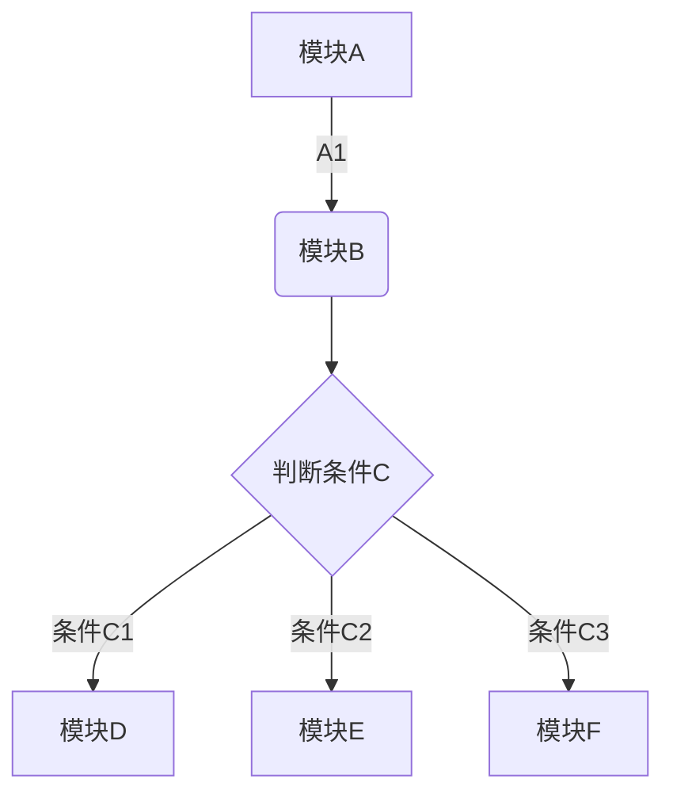

**Welcome to weihaizhang’s blog!**
```
#载入数据
mport pandas as pd
data=pd.read_csv(./)
```
***
**这是一个流程图**


```mermaid
graph TD
A[模块A] -->|A1| B(模块B)
B --> C{判断条件C}
C -->|条件C1| D[模块D]
C -->|条件C2| E[模块E]
C -->|条件C3| F[模块F]
```
